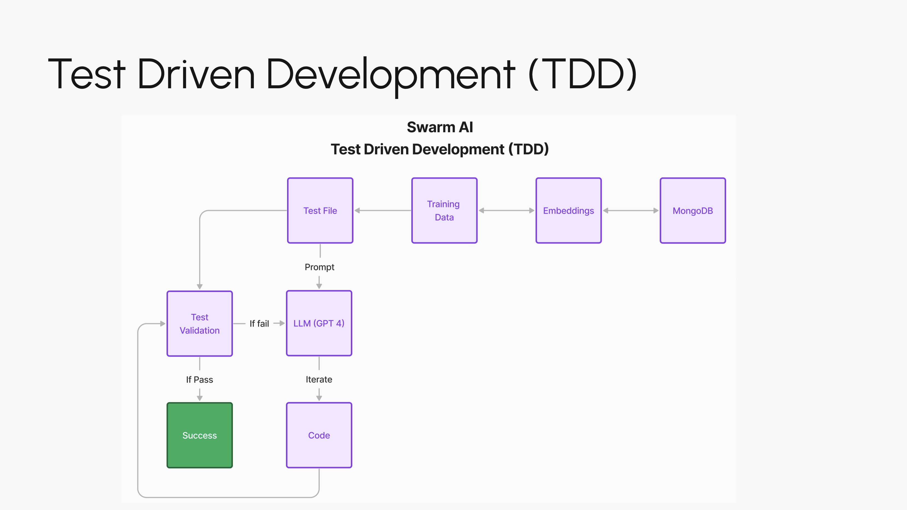

# Swarm AI

**Authors:**
| Name | GitHub | LinkedIn |
| ---- | ------ | -------- | 
| Tyler McGoffin | jtmcg | [linkedin.com/in/jtmcg/](https://www.linkedin.com/in/jtmcg/) |
| Kenneth Lo | klopmp | [linkedin.com/in/kennethlo/](https://www.linkedin.com/in/kennethlo/) |
| Dr. Ahmad Reza | | [linkedin.com/in/ahmad-reza-cheraghi/](https://www.linkedin.com/in/ahmad-reza-cheraghi/)|
| Vivian | | [linkedin.com/in/vivian-d-28268615](https://www.linkedin.com/in/vivian-d-28268615/) |

## Vision
LLM's don't do logic - they simply pattern match. That makes them really bad at writing functional code. How can we make sure an LLM does output functional code? 

### Hypothesis
We can give an LLM unit tests as prompts to write code, then validate the code created by the LLM using the tests we added originally. By piping this feedback back into the LLM and asking it to iterate, we can eventually get an output that is a functional piece of code.

## Architecture

There is an entire internet's worth of data available to train the model on. We can train this LLM to understand code patterns that make tests pass to improve the model. 

## Results

The demo included in `./basic_loop.ipynb` works for very simple test files. There are two examples included: `fibonacci_test.py` and `addition_test.py`

## Try it yourself

To try the model yourself, create a new python test file following the naming scheme `<name>_test.py`. Then, modify the `unittest_name` parameter in cell 3 in `./basic_loop.ipynb` to match the tests you've just written. Then run the notebook. It should create a new file, named `<name>.py`, and validate that file against the tests you've provided. It will loop until all the tests pass (WARNING: this could take a really long time). 

## Future development

- Smarter prompts: 
  - If things aren't running, prompt to fix runtime errors first
  - Be content aware of the number of tests that are passing/failing and which tests are passing and failing and feed that back into the model
- Better model
  - Train the model (we're currently using GPT3.5 in this demo)
- Parallelize the work
  - Extend to different LLMs to get different models to work on the same problem
  - Parallelize multiple instances of the same LLM to get results faster